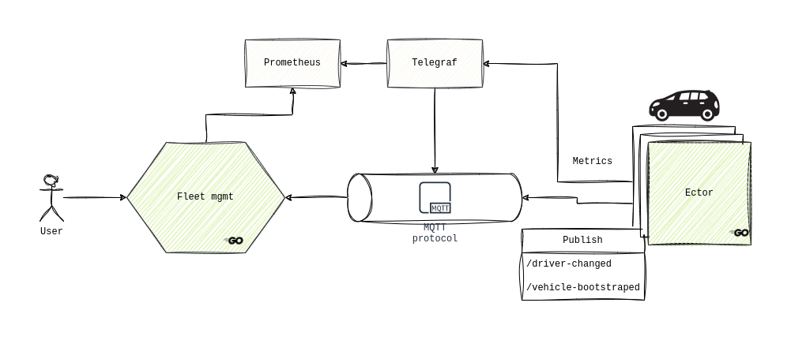

# FantastiGo App

> :note: Purpose of this repository is to learn go and libraries within go's echo system, to identify and apply best practices. Output of the findings are located in [docs](./docs) directory.

FantastiGo app enables businesses to monitor their vehicle fleets, e.g. correctness of a vehicle, fuel level and consumption, location, speed, etc. Having the necessary information and insights about the state of the vehicles, user can configure appropriate alarms and proactively respond to challenges.

## Solution

Solution is formed by several components, where emphasis is on `ector` and `fleet management` applications.

### Ector
`ector` application is installed on a vehicle itself. It's main purpose is to collect data from the vehicle sensors and make the collected data visible to the `fleet-management` app.

To make things a bit more interesting, `ector` also provides other information by publishing messages to `mqtt` topics.
- Each time a vehicle is started, a message is sent via `/vehicle-started` topic. This topic serves for two purposes. One being vehicle status marked as online, and the other is vehicle registration within the system in case vehicle id is unknown.
- After vehicle is started, driver identifies himself within the vehicle. This information is propagated through the system via `/driver-changed` topic.

### Fleet management

`fleet-management` app enables end-user to interact with the system by providing a [REST Api](todo://swagger-docs), which can be used to manage drivers and vehicles, monitor fleet metrics, and set up alarms.

## Development

### Quick start
1. Build app: docker build -t fantastigo
2. Run app: docker run -p 8080:8080 fantastigo